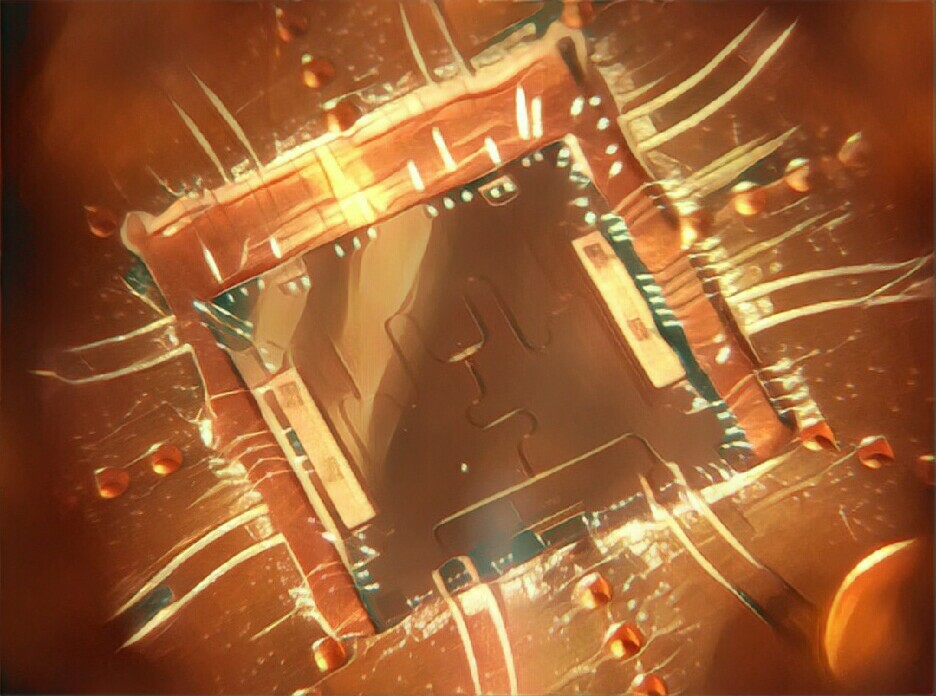

<section id="banner">
  

    <h2>{{ site.title }}</h2>
    
{{ site.description | markdownify }}

    <ul class="actions">
    </ul>
  

  <a href="#one" class="more scrolly">Learn More</a>
</section>

<section id="one" class="wrapper alt style2">
  <section class="spotlight">
    

      <h2>Who am I?</h2>
      
I'm currently working on my PhD in <a href="http://ltl.tkk.fi/PICO/wordpress/">Jukka Pekola's PICO Group. </a> at Aalto University 

    

  </section>
  <section class="spotlight">
    

      <h2>Quantum Thermodynamics in  
      Superconducting Circuits </h2>
      
I'm currently working on mesoscopic experiments at the interface between classical and 'quantum' thermodynamics. To do this, we're trying to measure the heat flow through a qubit interacting with two resonantly coupled thermal islands.

    

  </section>
  <section class="spotlight">
    

      <h2>Augue eleifend aliquet 
      sed condimentum</h2>
      
Aliquam ut ex ut augue consectetur interdum. Donec hendrerit imperdiet. Mauris eleifend fringilla nullam aenean mi ligula.

    

  </section>
</section>
